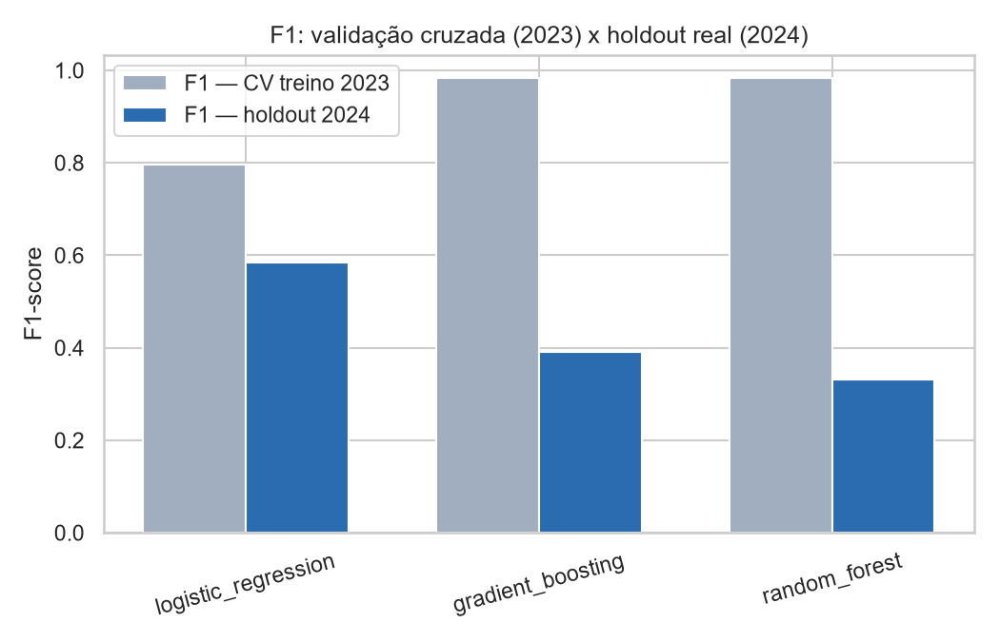
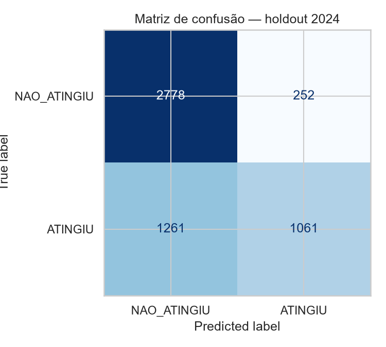
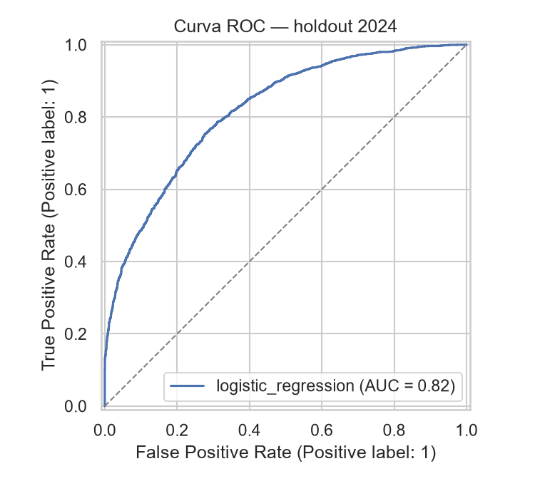
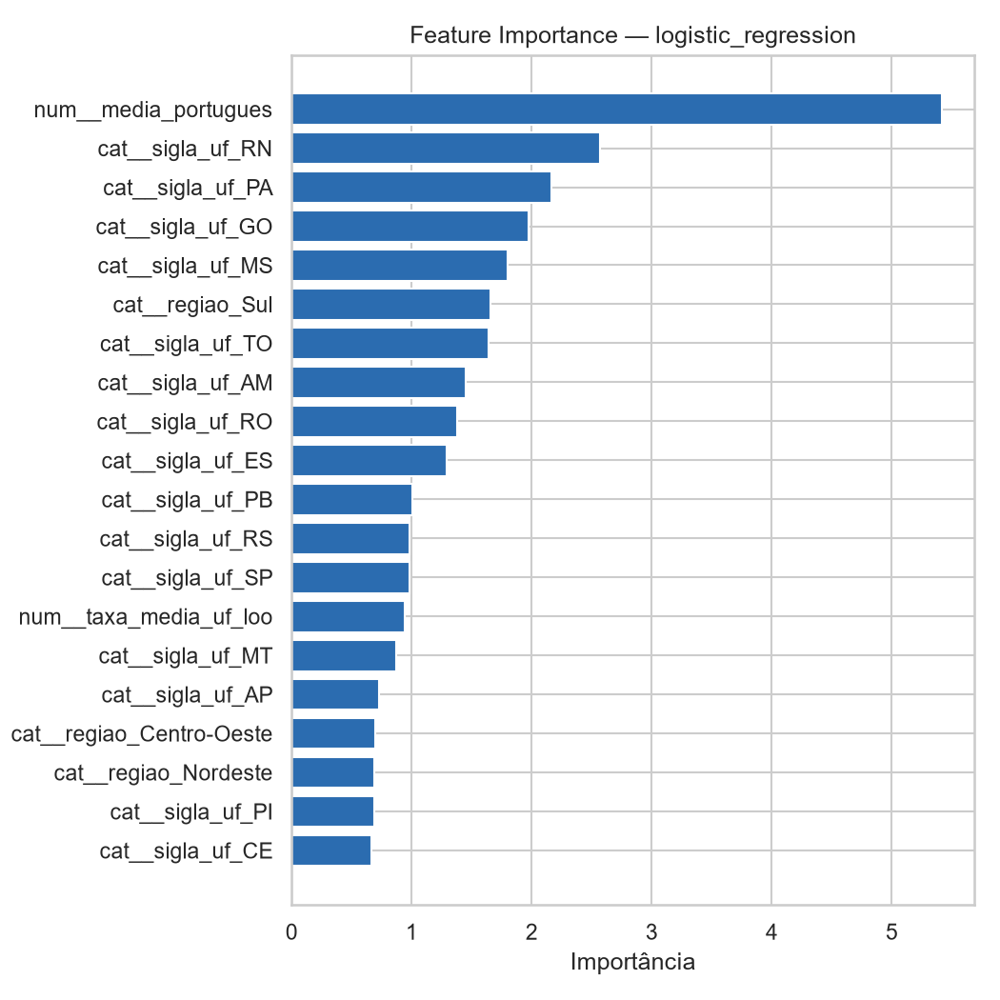
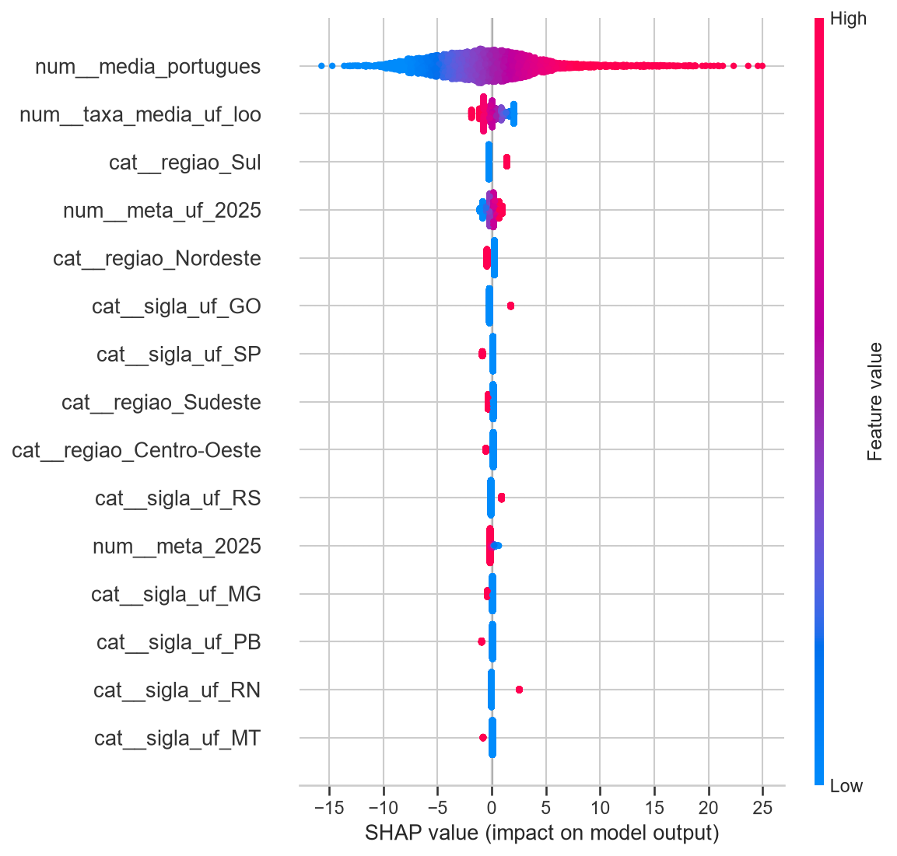

# Tech Challenge — Fase 3

**Predição e Inteligência Analítica para Alfabetização no Brasil**

Projeto integrador da Pós-Tech (Fase 3), que consolida os conhecimentos de Ciência de Dados e
Machine Learning aplicados a um problema real do contexto educacional brasileiro, dando
continuidade ao pipeline de dados construído na [Fase 2](https://github.com/Luodev/1IAST-Fase2)
(`Luodev/1IAST-Fase2`).

---

## Contexto do problema

A alfabetização infantil é um dos principais indicadores do desenvolvimento educacional e social
do Brasil. O governo federal, através do **Compromisso Nacional Criança Alfabetizada (PNA)**,
estabelece metas progressivas de alfabetização por município, estado e nível nacional até 2030.
Compreender apenas os dados atuais não é suficiente para apoiar decisões estratégicas: gestores
públicos precisam **antecipar riscos**, identificar regiões vulneráveis e entender quais fatores
mais impactam os indicadores educacionais.

Na Fase 2, construímos a pipeline de engenharia de dados (arquitetura *medallion*
Bronze → Silver → Gold, em AWS Glue/S3/Athena) que integra o **Indicador Criança Alfabetizada**
com metas nacionais/estaduais/municipais, dados territoriais e indicadores educacionais do INEP.
Nesta Fase 3, esses dados tratados são utilizados para desenvolver um modelo supervisionado capaz
de apoiar a tomada de decisão em políticas públicas educacionais.

> **Nota sobre a origem dos dados desta Fase 3:** este projeto não tem acesso à conta AWS
> Learner Lab efêmera usada na Fase 2 (contas de laboratório acadêmico expiram). Para garantir
> reprodutibilidade, a camada Gold foi **reconstruída localmente em Python/pandas**
> (`src/etl/bronze.py`, `silver.py`, `gold.py`), replicando fielmente a lógica dos jobs
> PySpark/Glue originais (`glue_jobs/etl_bronze.py`, `etl_silver.py`, `etl_gold.py` da Fase 2),
> a partir dos mesmos 5 CSVs brutos do INEP hospedados no repositório da Fase 2 (`dados/`). As
> quatro visões Gold e suas regras de negócio são idênticas às definidas na Fase 2.

## Objetivo analítico

Desenvolver um modelo supervisionado capaz de prever se um município **atingirá adequadamente
seu padrão de alfabetização**, utilizando variáveis educacionais, territoriais e de contexto
regional.

O enunciado do desafio pede um modelo que preveja se **"um aluno" será alfabetizado ou não**.
Como o INEP não publica microdados por aluno (dado protegido por sigilo estatístico e pela LGPD),
a menor granularidade disponível publicamente é o **município-ano** (por rede de ensino). A
variável-alvo deste projeto — `alvo_alfabetizado` — é, portanto, um **proxy operacional em nível
municipal**, definido como:

```
alvo_alfabetizado = 1  se  taxa_alfabetizacao (observada) >= meta_alfabetizacao_2025 (meta do PNA para o município)
alvo_alfabetizado = 0  caso contrário
```

Essa definição reaproveita diretamente a visão Gold `alfabetizacao_por_municipio`
(`status_meta_2025`) já construída na Fase 2, garantindo consistência analítica entre as fases e
respondendo diretamente à pergunta de negócio "quais municípios podem não atingir metas futuras?".
A justificativa completa está na seção [Limitações do projeto](#limitações-do-projeto) e no
notebook [`01_analise_exploratoria.ipynb`](notebooks/01_analise_exploratoria.ipynb).

## Descrição da base utilizada

| Fonte (INEP, via Base dos Dados) | Linhas | Papel na pipeline |
|---|---:|---|
| `br_inep_avaliacao_alfabetizacao_municipio.csv` | 23.995 | Indicador de alfabetização por município (taxa, proficiência) |
| `br_inep_avaliacao_alfabetizacao_uf.csv` | 145 | Indicador de alfabetização por UF |
| `..._meta_alfabetizacao_brasil.csv` | 3 | Metas nacionais do PNA (2024-2030) |
| `..._meta_alfabetizacao_uf.csv` | 54 | Metas estaduais do PNA |
| `..._meta_alfabetizacao_municipio.csv` | 10.704 | Metas municipais do PNA |

A pipeline segue a arquitetura *medallion* da Fase 2:

- **Bronze** (`src/etl/bronze.py`): leitura com schema explícito, hash de deduplicação
  (`_record_hash`), checks de qualidade (nulidade, faixa de valores, domínio categórico).
- **Silver** (`src/etl/silver.py`): decodificação de códigos de rede INEP, arredondamento,
  regras de qualidade por linha, separação PASS/QUARENTENA.
- **Gold** (`src/etl/gold.py`): as **4 visões analíticas** da Fase 2 —
  `alfabetizacao_por_municipio`, `evolucao_temporal`, `ranking_municipios` (via *window function*)
  e `comparacao_metas_nacionais`.
- **Features** (`src/preprocessing/build_features.py`): dataset final de modelagem, no grão
  *município x ano* (rede municipal), com engenharia de atributos adicional (ver abaixo).

Reproduza a pipeline completa com:

```bash
python -m src.etl.run_pipeline          # Bronze -> Silver -> Gold
python -m src.preprocessing.build_features
python -m src.modeling.train            # treino, avaliação e artefatos de interpretabilidade
```

## Etapas de modelagem

### 1. Tratamento de data leakage (decisão central do projeto)

Antes de definir as features, investigamos (ver notebook 01, seção 4) quais colunas da base são
transformações quase-determinísticas da própria métrica usada para construir o alvo. Foram
**excluídas** por vazamento:

| Coluna excluída | Motivo |
|---|---|
| `taxa_alfabetizacao`, `gap_meta_2025` | Definem o alvo diretamente |
| `nivel_alfabetizacao` | Bucket discreto de `taxa_alfabetizacao` (nível 5 = 100% dos casos com `ATINGIU`) |
| `proporcao_aluno_nivel_5` a `_8` | Soma tem correlação de **0,99** com `taxa_alfabetizacao` — é a mesma medida decomposta por nível de proficiência SAEB |
| `serie` | Constante (sempre = 2) em toda a base — sem variância, sem valor preditivo |
| `meta_alfabetizacao_2030` | Constante (sempre = 80,0) em toda a base |

`media_portugues` foi **mantida**: apesar de correlacionada (0,93) com a taxa, é uma medida
psicométrica distinta (escala de proficiência ~650-870, não percentual de aprovação) — feature
legítima, não uma transformação do alvo.

### 2. Engenharia de atributos

- **Território**: `sigla_uf` e `regiao` derivados dos 2 primeiros dígitos do código IBGE do
  município (mesmo mapeamento usado na visão Gold `ranking_municipios`).
- **Meta estadual** (`meta_uf_2025`): meta do PNA publicada para a UF — conhecida a priori, sem
  vazamento.
- **Contexto regional *leave-one-out*** (`taxa_media_uf_loo`): média da taxa de alfabetização dos
  municípios **pares** da mesma UF/ano, **excluindo o próprio município** do cálculo — captura
  efeito regional sem vazar a métrica do registro que está sendo previsto.

### 3. Pipeline Scikit-learn (pré-processamento integrado ao modelo)

```python
ColumnTransformer(
    num = SimpleImputer(strategy="median") -> StandardScaler,      # media_portugues, meta_2025, meta_uf_2025, taxa_media_uf_loo
    cat = SimpleImputer(strategy="most_frequent") -> OneHotEncoder, # sigla_uf, regiao
)
Pipeline(preprocessor, classifier)
```

O pré-processamento fica **dentro** do `Pipeline`, portanto é reajustado a cada fold de validação
cruzada — nenhuma estatística (mediana, moda, escala) do fold de validação ou do holdout vaza
para o treino.

### 4. Validação: split temporal + validação cruzada

- **Split temporal (anti-leakage principal)**: treino = ano **2023** (5.302 municípios), holdout
  = ano **2024** (5.352 municípios). O modelo nunca vê 2024 durante o tuning — testa a capacidade
  real de generalizar para o **futuro**, diretamente alinhado à pergunta "prever municípios que
  podem não atingir metas futuras".
- **Tuning**: `GridSearchCV` com `StratifiedKFold` (5 folds) **dentro do treino de 2023**.

## Escolha do algoritmo

Três modelos foram comparados via `GridSearchCV` (ver
[`02_modelagem.ipynb`](notebooks/02_modelagem.ipynb) e `reports/comparacao_modelos.csv`):

| Modelo | F1 — CV treino (2023) | F1 — holdout (2024) | ROC-AUC — holdout (2024) |
|---|---:|---:|---:|
| **Regressão Logística** ✅ | 0,796 | **0,584** | **0,819** |
| Gradient Boosting | 0,984 | 0,391 | 0,782 |
| Random Forest | 0,983 | 0,332 | 0,612 |

**Modelo final: Regressão Logística** (`class_weight="balanced"`, `C=1.0`), selecionado pelo
melhor ROC-AUC no holdout real de 2024 — não pelo melhor score de validação cruzada.

**Por que não os modelos de árvore, apesar do F1 de CV muito mais alto?** Esse é o achado mais
importante do processo de validação deste projeto: Random Forest e Gradient Boosting atingem
F1 ≈ 0,98 em validação cruzada **dentro do próprio ano de treino (2023)**, mas caem para
F1 ≈ 0,33–0,39 no holdout real de 2024 — um sinal claro de **overfitting temporal**. Com um
conjunto pequeno de features contínuas, árvores sem restrição efetiva de complexidade memorizam
padrões específicos de 2023 que não se repetem em 2024. A Regressão Logística, mais simples e
regularizada, generaliza de forma muito mais consistente (ROC-AUC 0,819 no holdout).

Esse resultado reforça, na prática, por que o desafio exige "validação garantindo replicabilidade
e generalização": um modelo escolhido apenas pela métrica de CV dentro do período de treino teria
sido a pior escolha possível em produção.



## Métricas de avaliação

Métricas do modelo final (Regressão Logística) no **holdout de 2024** (dados nunca vistos durante
o treino/tuning):

| Métrica | Valor |
|---|---:|
| Acurácia | 0,717 |
| Precisão | 0,808 |
| Recall | 0,457 |
| F1-score | 0,584 |
| ROC-AUC | 0,819 |

Matriz de confusão (holdout 2024, 5.352 municípios):

|  | Previsto: NAO_ATINGIU | Previsto: ATINGIU |
|---|---:|---:|
| **Real: NAO_ATINGIU** | 2.778 | 252 |
| **Real: ATINGIU** | 1.261 | 1.061 |




**Leitura das métricas:** a precisão (0,81) é maior que o recall (0,46) — o modelo é conservador
ao prever "ATINGIU": quando prevê positivo, acerta na maioria das vezes, mas ainda deixa passar
municípios que de fato atingiram a meta (falsos negativos). Para o caso de uso de política pública
(priorizar municípios de risco para intervenção), esse comportamento é aceitável: é preferível
sinalizar como "em risco" municípios que na verdade estão bem (falso positivo, custo = atenção
extra) do que deixar de identificar municípios verdadeiramente vulneráveis.

## Interpretação dos resultados

Interpretabilidade obtida via **Feature Importance nativa** (valor absoluto dos coeficientes,
padronizados) e **SHAP Values** (`shap.LinearExplainer`):




- **`media_portugues`** é, disparadamente, a variável mais influente — coerente com a correlação
  de 0,93 com a taxa de alfabetização observada na EDA, mas sendo uma medida psicométrica distinta
  do alvo (proficiência em Português, não vazamento).
- **UF e Região** contribuem de forma secundária, porém consistente — municípios do **Sul** e
  **Centro-Oeste** têm maior probabilidade prevista de atingir a meta; **Norte** e **Nordeste**,
  menor — confirmando a heterogeneidade regional observada na análise exploratória.
- **Contexto estadual** (`taxa_media_uf_loo`, `meta_uf_2025`) tem contribuição menor, mas real:
  municípios cercados por pares de melhor desempenho tendem a ter maior probabilidade prevista de
  sucesso — um efeito de vizinhança regional plausível (infraestrutura estadual, formação de
  professores compartilhada, políticas estaduais).

## Insights encontrados

1. **Risco educacional concentrado no Norte e Nordeste.** A probabilidade média prevista de
   atingir a meta 2025 (holdout 2024) é de apenas **5,9%** no Norte e **20,7%** no Nordeste,
   contra **36,3%** no Centro-Oeste e **45,4%** no Sul — uma diferença de quase 8x entre a região
   de maior e menor risco.
2. **A meta municipal por si só não garante alfabetização adequada em termos absolutos.** Como as
   metas do PNA são progressivas e individualizadas por município (municípios que partem de bases
   muito baixas recebem metas de curto prazo também baixas), "atingir a meta" não é sinônimo de
   "alta taxa de alfabetização em termos absolutos" — é um indicador de **progresso na
   trajetória**, não de patamar absoluto. Isso deve ser comunicado com cuidado a gestores públicos.
3. **Overfitting temporal é um risco real e mensurável neste domínio** (ver seção "Escolha do
   algoritmo") — validação cruzada dentro de um único ano pode ser enganosamente otimista quando
   o objetivo é prever o futuro.
4. **A proficiência em Português (`media_portugues`) é o sinal mais forte e estável disponível
   sem vazamento** — um indicador de fácil coleta e monitoramento contínuo que já concentra a
   maior parte do poder preditivo do modelo.

## Limitações do projeto

- **Grão de análise municipal, não individual.** O alvo é definido em nível *município-ano* (rede
  municipal), não no nível do aluno. Microdados de alunos não são publicados pelo INEP (sigilo
  estatístico/LGPD) — essa é uma limitação estrutural da base pública disponível, não uma escolha
  arbitrária do projeto.
- **Janela temporal curta.** Apenas 2 anos (2023-2024) de dados consolidados na camada Gold da
  Fase 2, permitindo um único split temporal de validação (sem múltiplas janelas *rolling*).
- **Cobertura desigual de features.** As proporções de proficiência SAEB por nível só estão
  disponíveis para 2024 (2023 é 100% nulo nessa dimensão) — e, como descrito acima, foram
  excluídas por vazamento de qualquer forma.
- **Visão Gold `comparacao_metas_nacionais` pouco aproveitável.** A rede "total" (código 0) do
  indicador por UF é extremamente esparsa na base de origem (1 único registro em toda a série
  2023-2024) — limitação da própria base pública, não do código da pipeline.
- **Ausência de enriquecimento externo.** O modelo usa exclusivamente dados derivados da base
  INEP/PNA da Fase 2. Fontes externas sugeridas no desafio (IBGE, Censo Escolar, FUNDEB, PNAD,
  Cadastro Único) não foram incorporadas nesta versão — ver "Possíveis evoluções futuras".
- **Poder preditivo moderado (recall 0,46).** O modelo deixa passar uma parcela relevante de
  municípios que de fato atingiram a meta — adequado para priorização/triagem, mas não deve ser
  usado como critério único e automático de alocação de recursos.

## Aplicação prática para políticas públicas

- **Priorização de intervenção**: a lista de municípios ordenados por menor probabilidade prevista
  de atingir a meta (gerada em `02_modelagem.ipynb`, seção 6) pode orientar a alocação de recursos
  do PNA — formação de professores, materiais didáticos, apoio técnico — para os municípios de
  maior risco antes que o resultado do ano corrente seja consolidado.
- **Monitoramento regional**: a concentração de risco no Norte e Nordeste sugere políticas
  regionalizadas e diferenciadas, em vez de metas/estratégias uniformes nacionalmente.
- **Indicador de alerta precoce**: como `media_portugues` é o maior preditor e é mensurado por
  avaliações intermediárias (não apenas o resultado final), gestores podem usar quedas nesse
  indicador como sinal de alerta antes do fechamento do ciclo avaliativo.
- **Simulação de cenários**: por ser interpretável (coeficientes lineares + SHAP), o modelo permite
  simular o efeito de melhorias incrementais em proficiência sobre a probabilidade de atingir a
  meta — útil para dimensionar metas de programas de reforço escolar.

## Possíveis evoluções futuras

- Incorporar múltiplos anos históricos do INEP/ANA (quando disponíveis) para validação temporal
  mais robusta (*rolling-window* / *walk-forward validation*).
- Enriquecer a base com fontes externas sugeridas no desafio: IBGE (PIB per capita, IDH municipal,
  população), Censo Escolar (infraestrutura, formação docente, razão aluno/professor), FUNDEB
  (investimento por aluno) e Cadastro Único (vulnerabilidade socioeconômica).
- Testar modelos de árvore com regularização mais agressiva (profundidade máxima restrita,
  `min_samples_leaf` mais alto, `ccp_alpha`) e comparar novamente no holdout temporal — o
  resultado atual não descarta árvores, apenas evidencia que a configuração testada overfitou.
- Explorar clusterização de municípios por padrão socioeducacional (pergunta "quais regiões
  possuem padrões semelhantes?") como etapa não-supervisionada complementar.
- Modelo de série temporal para projetar trajetória de cada município até 2030, comparando com a
  meta escalonada ano a ano do PNA.

---

## Estrutura do repositório

```
tech-challenge-fase3
│
├── data/
│   ├── raw/            # 5 CSVs brutos do INEP (baixados do repo da Fase 2)
│   ├── bronze/          # camada SOR (parquet)
│   ├── silver/           # camada SOT — pass/ e quarentena/ (parquet)
│   ├── gold/             # 4 visões analíticas (parquet)
│   └── features/         # dataset final de modelagem (parquet)
│
├── notebooks/
│   ├── 01_analise_exploratoria.ipynb
│   └── 02_modelagem.ipynb
│
├── src/
│   ├── etl/               # bronze.py, silver.py, gold.py, run_pipeline.py, uf_lookup.py
│   ├── preprocessing/      # build_features.py
│   ├── modeling/           # pipeline.py, train.py
│   ├── evaluation/         # metrics.py, interpretability.py
│   └── visualization/      # plots.py
│
├── reports/
│   ├── comparacao_modelos.csv
│   ├── resumo_treino.json
│   ├── modelo_final.joblib
│   ├── decisoes_analiticas.md
│   └── roteiro_video_executivo.md
│
├── images/                 # gráficos gerados pelos notebooks/treino
├── requirements.txt
├── README.md
└── .gitignore
```

## Como reproduzir

```bash
python -m venv .venv
.venv\Scripts\activate          # Windows
pip install -r requirements.txt

python -m src.etl.run_pipeline
python -m src.preprocessing.build_features
python -m src.modeling.train

jupyter nbconvert --to notebook --execute --inplace notebooks/01_analise_exploratoria.ipynb
jupyter nbconvert --to notebook --execute --inplace notebooks/02_modelagem.ipynb
```

## Créditos

Dados brutos, arquitetura *medallion* e regras de negócio das visões Gold: Tech Challenge Fase 2
— [`Luodev/1IAST-Fase2`](https://github.com/Luodev/1IAST-Fase2).
